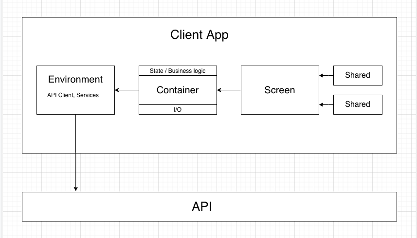

# Roundtrip React Coding Challenge - Jeremy Purser

Deployed  live on [GitHub pages](https://jeremypurser.github.io/roundtrip-react-challenge/).

## Table of Contents

1. [Getting Started](#getting-started)
    - [Available Scripts](#available-scripts)
2. [File Structure](#file-structure)
3. [Design and Architecture](#design-and-architecture)
    - [TypeScript](#typescript)
    - [Diagram](#diagram)
    - [API Client](#api-client)
    - [Environment](#environment)
    - [Screens and Containers](#screens-and-containers)
    - [State Management](#state-management)

## Getting Started

To run this project locally, clone the repo:
```sh
git clone git@github.com:jeremypurser/roundtrip-react-challenge.git
```
Install the dependencies:
```sh
npm install
```
Create the environemnet variables:
```sh
cp .env.example .env
```

This client app serves data from a [mocked API](https://github.com/RideRoundTrip/react-challenge). Follow the [documentation](https://github.com/RideRoundTrip/react-challenge#setup) to run the server.


### Available Scripts

In the project directory, you can run:

### `npm start`

Runs the app in the development mode.<br />
Open [http://localhost:3001](http://localhost:3001) to view it in the browser.

### `npm test`

Launches the test runner in the interactive watch mode.<br />


### `npm run build`

Builds the app for production to the `build` folder.<br />

## File Structure

```sh
src/
  __test__/  # Unit tests
    __snapshots__/ # React test references
  api/ # API Client interfaces and implementations
  components/ # React components
    containers/ # Higher order components connected to state and business logic
    screens/ # Purely presentational screens
    shared/ # Reusable components
  config/ # Coordinates major dependencies
  util/ # Helper functions

```

## Design and Architecture

This project was bootstrapped with [Create React App](https://github.com/facebook/create-react-app). Given more time I would prefer a server-side rendered solution, however, for the sake of velocity I chose CRA.

**Initial Data**
The `unmatched_plan` is fetched on the page load from a random integer of available ids (1 - 4).

**Text Input Data**
I chose to make the text inputs read-only based on the requirements docs. They are populated by data retrieved from the API and the input data is immutable.

### TypeScript

This app uses TypeScript to leverage static analysis for code coverage and to minimize runtime errors during the development process. The TS style follows many conventions from [_Effective TypeScript_](https://www.oreilly.com/library/view/effective-typescript/9781492053736/). The codebase minimizes the use of `any` types. Given more time, I would have more strongly typed the return types of the API Client methods.

### Diagram



### API Client

The API Client is a class adhering to an interface that could have any implementation, including a `mockAPI` client for testing. The API Client class extends a base class that handles logging and fetching. The implementation of the API Client is easily extended and provides succinct calls by abstracting boilerplate required by the native `fetch`.

I noticed the `POST` methods on the mock server do not protect against duplicate entries. Given more time, I could protect against in the client, however, it would degrade performance with additional API calls.

### Environment

For extensibility and maintainability, major dependencies and services are accessed through the [`Environment`](src/config/Environment.ts) object. The `Environment` class is a singleton that provides access to services through the `.current` property.

_Example_

```typescript
const { api } = Environment.current;
```

The dependencies are `.set` on the `.current` property in the [`start`](src/index.tsx) of the application before the call to `ReactDOM.render`.

```typescript
/** ... */
Environment.set({
  api: new APIClient('http://api.example.com'),
  anotherService: ImportedLibrary
});
/** ... */
```

### Screens and Containers

For separation of concerns `Screen` components are purely presentational components that consume props from a parent and return JSX. Screens are consumed by higher order components, `Containers`, that return a `Screen` connected to state and business logic.

_Example_

```typescript
// UserScreen.tsx
import React from 'react';
import { UserProps } from '../containers/UserContainer';

export const UserScreen = (props: User) => {
  return <div>{props.name}</div>;
}

// UserContainer.tsx
import React from 'react';

export interface UserProps {
  name: string;
}

export const userContainer = (Screen: React.ComponentType<UserProps>) => () => {
  const [user, setUser] = React.useState();

  useEffect(() => {
    api.getUser({id: 3}).then(setUser);
  });

  return <Screen name={user.name}>;
}

// Call of connected component
// App.tsx
import React from 'react';
import { UserScreen } from './components/screens/UserScreen';
import { userContainer } from './components/containers/UserContainer';

const User = userContainer(UserScreen);

const App = () => {
  return (
    <div>
      <User />
    </div>
  );
}
```

### State Management

This application doesn't use any dependencies besides `React` for state management. The codebase uses functional components and the React Hooks API to manage state, I/O, and side effects. In the future, if state is needed my multiple components, we may introduce a pattern to lift state with the `Context` API or a library such as `Redux`.


